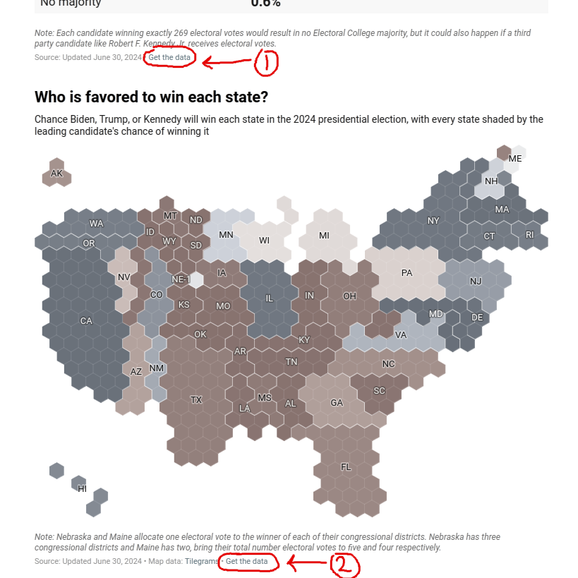

# 538classic

A simple webpage that displays Nate Silver's presidential election forecast (https://www.natesilver.net/p/nate-silver-2024-president-election-polls-model) in a chloropleth modeled on the FiveThirtyEight 2016 visualization style. The SVG code for the US map comes from https://simplemaps.com/resources/svg-us and can be freely distributed, including for commercial purposes.

I have redacted the URLs of the forecast .csv data for 2024, even though strictly speaking they are publicly exposed, because Nate has paywalled his forecast and I don't intend to provide a circumvention method. If you are subscribed to his forecast, you can find the URLs for these .csv files on the main forecast page here:

the destination of (1) should be nationalDataURL and the destination of (2) should be stateDataURL.
